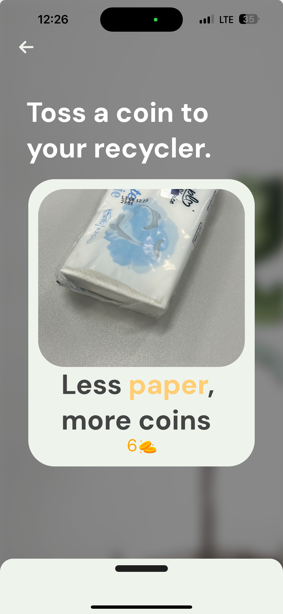

# Recyco.
> ### Recycling made easy, fun and challenging.

We bring the fun in recycling by providing the user with a coins system for recycling, awards and challenges.

  
  

How? The user scans the object he wants to recycle, and we provide output regarding the material of the object if the object is recyclable and details about the container type for that object .

  
  
  

The user can earn more points by completing challenges.

  
  

With the earned points the user can buy multipliers, to earn more coins, from the shop. The total points of a user will place him in a leaderboard where he can visualize in real time the place he has.

  
  

The app also provides stats regarding the percentage of the material recycled using our app and on the profile the user can visualize stats regarding their points.

  
  
  

